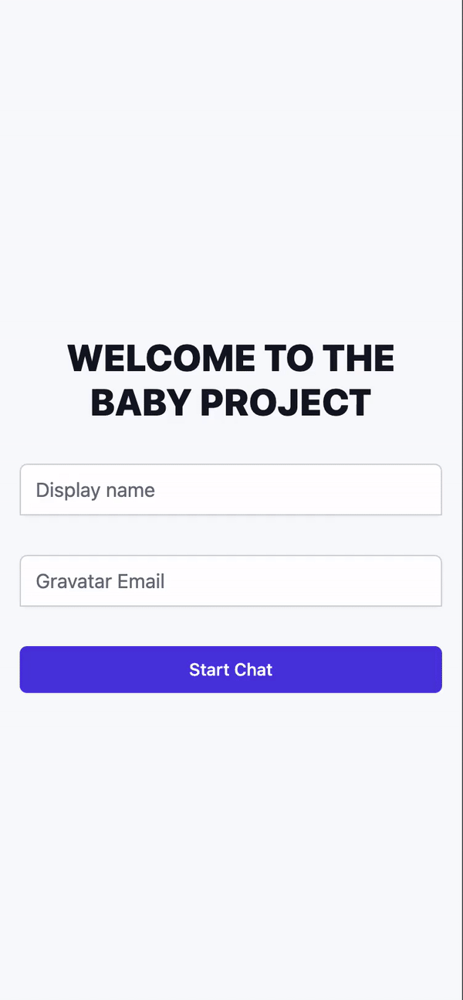

# Baby Project Ktor POC
The purpose of this POC is to evaluate Ktor and compare it to Spring Boot regarding our use case.
## Getting Started
### Docker
(comming soon)!
### Manual
1. Install Java 11
  - Pro Tip: To manage multiple versions of Java, you can use [Jenv](https://www.jenv.be/).
1. Run `./gradlew application:run`
1. Navigate to `http://localhost:8080` in your browser to see the running application

Note: Node.js is unnecessary to run this POC since the UI is built with the CDN-hosted version of Tailwind CSS
and the frontend code is plain old JavaScript.

