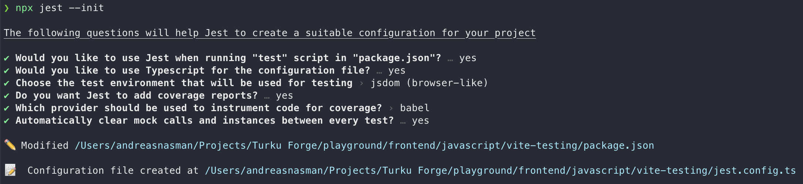
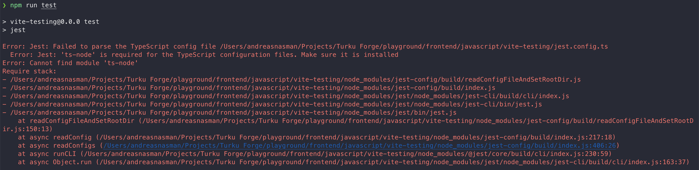
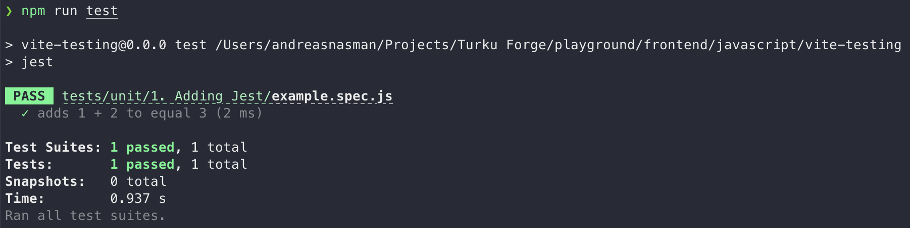
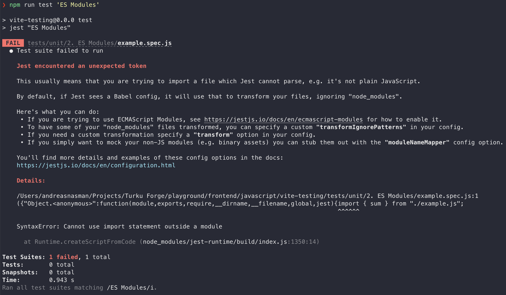
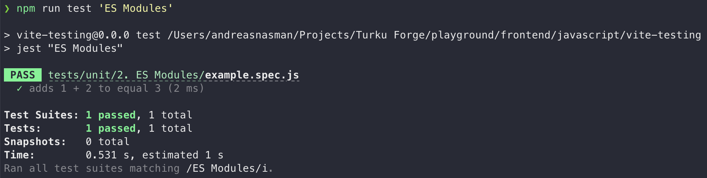
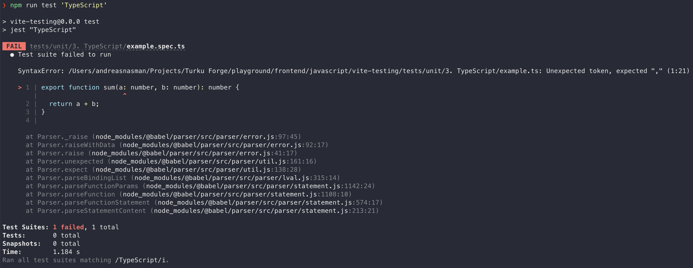
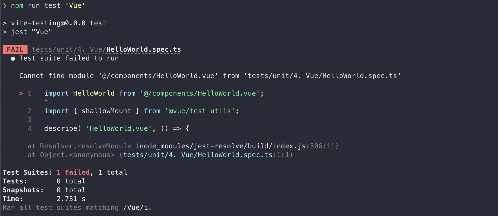
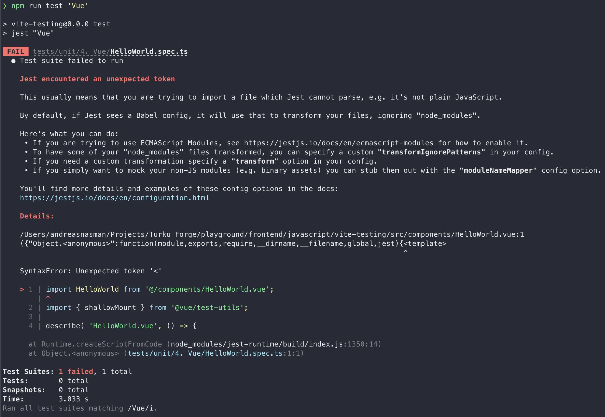
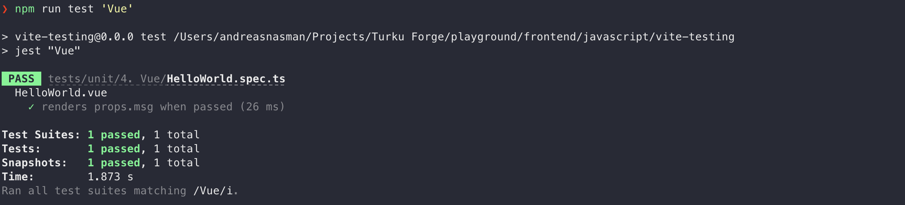

# Testing with Vite

- [1. Jest](#1-jest)
  - [Commands run](#commands-run)
  - [Scripts run](#scripts-run)
  - [Procedure](#procedure)
- [2. ES Modules](#2-es-modules)
  - [Commands run](#commands-run-1)
  - [Scripts run](#scripts-run-1)
  - [Procedure](#procedure-1)
- [3. TypeScript](#3-typescript)
  - [Commands run](#commands-run-2)
  - [Scripts run](#scripts-run-2)
  - [Procedure](#procedure-2)
- [4. Vue](#4-vue)
  - [Commands run](#commands-run-3)
  - [Scripts run](#scripts-run-3)
  - [Procedure](#procedure-3)
- [5. Experimental Vue](#5-experimental-vue)
  - [Commands run](#commands-run-4)
  - [Scripts run](#scripts-run-4)
  - [Procedure](#procedure-4)

## 1. Jest

### Commands run

```shell
npm install --save-dev jest
npx jest --init
npm install --save-dev ts-node
```

### Scripts run

```shell
npm run test
```

---

### Procedure

First and foremost, we add [Jest](https://jestjs.io/) as a `devDependency` with

```shell
npm i -D jest
```

We can then add a basic configuration file to the root of the project and a `test` command to `scripts` in `package.json` by running

```shell
npx jest --init
```

We select the following features:



Trying to run `npm run test` results in the follow error:



Since we want to have the Jest configuration in TypeScript file format, `jest.config.ts`, we do as the error text suggests and add [`ts-node`](https://github.com/TypeStrong/ts-node) with

```shell
npm i -D ts-node
```

Running the test script again negates the error, but fails since we no tests yet.


We can now add a basic JavaScript file using CommonJS modules with a corresponding specification file to successfully run tests with Jest!

```js:frontend/javascript/vite-testing/tests/unit/1_jest/example.js

```

```js:frontend/javascript/vite-testing/tests/unit/1_jest/example.spec.js

```



---

## 2. ES Modules

### Commands run

```shell
npm install --save-dev babel-jest @babel/core @babel/preset-env
```

### Scripts run

```shell
npm run test
```

---

### Procedure

Running a test written with ES Modules produces the following error:

```js:frontend/javascript/vite-testing/tests/unit/2_es_modules/example.js

```

```js:frontend/javascript/vite-testing/tests/unit/2_es_modules/example.spec.js

```



We could change the [test script to use experimental ES Module features in Node.js](https://jestjs.io/docs/ecmascript-modules), but since we want to use [TypeScript](https://www.typescriptlang.org/) later on, we'll add [Babel](https://babeljs.io/) and configure it according to [the instructions from Jest's documentation](https://jestjs.io/docs/getting-started#using-babel).

```shell
npm i -D babel-jest @babel/core @babel/preset-env
```

```js:frontend/javascript/vite-testing/babel.config.js

```

Running `npm run test` now succeeds!



## 3. TypeScript

### Commands run

```shell
npm install --save-dev ts-jest @types/jest
```

### Scripts run

```shell
npm run test
```

---

### Procedure

Trying to run a TypeScript test results in the follow error:

```ts:frontend/javascript/vite-testing/tests/unit/3_typescript/example.ts

```

```ts:frontend/javascript/vite-testing/tests/unit/3_typescript/example.spec.ts

```



Since we want type-checking in the tests as they run and full typing when we write them, we'll add [`ts-jest`](https://github.com/kulshekhar/ts-jest) along with [`@types/jest`](https://www.npmjs.com/package/@types/jest) by running

```shell
npm i -D ts-jest @types/jest
```

To utilize the installed `@types/jest` package we'll add it to our `tsconfig.json` file.

```diff
// tsconfig.json
{
  "compilerOptions": {
    //...
-   "types": ["vite/client"]
+   "types": ["vite/client", "@types/jest"]
  }
  //...
}
```

Next step is to tell Jest how to handle `.ts` files. We'll add a modified version of the [default `transform` property](https://jestjs.io/docs/configuration#transform-objectstring-pathtotransformer--pathtotransformer-object) in `jest.config.ts` to still use [`babel-jest`](https://www.npmjs.com/package/babel-jest) for `.js`, `jsx` and `tsx` files. For `.ts` files, we want to use `ts-jest`.

```diff
// jest.config.ts
export default {
  //...
  transform: {
-   "\\.[jt]sx?$": "babel-jest"
+   "\\.(jsx?|tsx)$": "babel-jest",
+   "\\.ts$": "ts-jest",
  },
  //...
};
```

The example Typescript specification now succeeds!


## 4. Vue

### Commands run

```shell
npm install --save-dev @vue/test-utils@next
npm install --save-dev vue-jest@next
```

### Scripts run

```shell
npm run test
```

---

### Procedure

To run tests for `.vue` files, we'll install [Vue Test Utils](https://next.vue-test-utils.vuejs.org/) – the official unit testing utility library for Vue.js.

```shell
npm i -D @vue/test-utils@next
```

Trying to run an example specification straight away won't work since we're missing a way for Jest to load `.vue` files. We're also missing support for the common `@` alias used in Vue applications.

```vue:frontend/javascript/vite-testing/src/components/HelloWorld.vue

```

```ts:frontend/javascript/vite-testing/tests/unit/4_vue/HelloWorld.spec.ts

```



Adding a regular expression–module name map to the `moduleNameMapper` option in `jest.config.ts` adds support for `@` aliases.

```diff
// jest.config.ts
export default {
  //...
- // moduleNameMapper: {},
+ moduleNameMapper: {
+   "^@/(.*)$": "<rootDir>/src/$1",
+ },
  //...
};
```

Running `npm run test` still fails since we haven't added `.vue` support for Jest just yet.



Adding [`vue-jest`](https://github.com/vuejs/vue-jest) and modifying the `transform` and `moduleFileExtensions` properties in `jest.config.ts` accordingly enables Jest to handle `.vue` files.

```shell
npm i -D vue-jest@next
```

```diff
// jest.config.ts
export default {
  //...
- // moduleFileExtensions: [
- //   "js",
- //   "json",
- //   "jsx",
- //   "ts",
- //   "tsx",
- //   "node"
- // ],
+ moduleFileExtensions: ["js", "json", "jsx", "ts", "tsx", "node", "vue"],
  //...
  transform: {
    "\\.(jsx?|tsx)$": "babel-jest",
    "\\.ts$": "ts-jest",
+   "\\.vue$": "vue-jest",
  },
  //...
};
```

We can now successfully test `.vue` files!



## 5. Experimental Vue

### Commands run

```shell
npm install --save-dev prettier
```

### Scripts run

```shell
npm run test
```

## Procedure

Next, we'll try two main features currently in an experimental phase: [`<script setup>`](https://github.com/vuejs/rfcs/blob/sfc-improvements/active-rfcs/0000-sfc-script-setup.md) and [`<suspense>`](https://v3.vuejs.org/guide/migration/suspense.html#introduction).

We'll start by adding a component utilizing these two features.

```vue:frontend/javascript/vite-testing/src/components/Experimental.vue

```

Utilizing `<script setup>` lets us bypass some boilerplate. Using an `await` on the root level of the `<script>` tag effectively makes the component asynchronous, and as such, should be surrounded by a `<suspense>` component where it's rendered.

The `useApi` function is quite trivial returning some predefined user data after a set delay.

```ts:frontend/javascript/vite-testing/src/composables/useApi.ts

```
