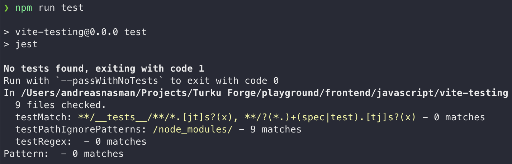

# Testing with Vite

- [Testing with Vite](#testing-with-vite)
  - [1. Adding Jest](#1-adding-jest)
    - [Commands run](#commands-run)
    - [Scripts run](#scripts-run)
    - [Description](#description)

## 1. Adding Jest

### Commands run

```shell
npm install --save-dev jest
npx jest --init
npm install --save-dev ts-node
```

### Scripts run

```shell
npm run test
```

---

### Description

First and foremost, we add [Jest](https://jestjs.io/) as a `devDependency` with

```shell
npm i -D jest
```

We can then add a basic configuration file to the root of the project and a `test` command to `scripts` in `package.json` by running

```shell
npx jest --init
```

We select the following features:


Trying to run `npm run test` results in this error:


Since we want to have the Jest configuration in Typescript file format, `jest.config.ts`, we do as the error text suggests and add [`ts-node`](https://github.com/TypeStrong/ts-node) with

```shell
npm i -D ts-node
```

Running the test script again negates the error, but fails since we no tests yet.



We can now add a basic JavaScript file using CommonJS modules with a corresponding specification file to successfully run tests with Jest!

```js
// example.js
function sum(a, b) {
  return a + b;
}
module.exports = sum;
```

```js
// example.spec.js
const sum = require("./example.js");

test("adds 1 + 2 to equal 3", () => {
  expect(sum(1, 2)).toBe(3);
});
```


